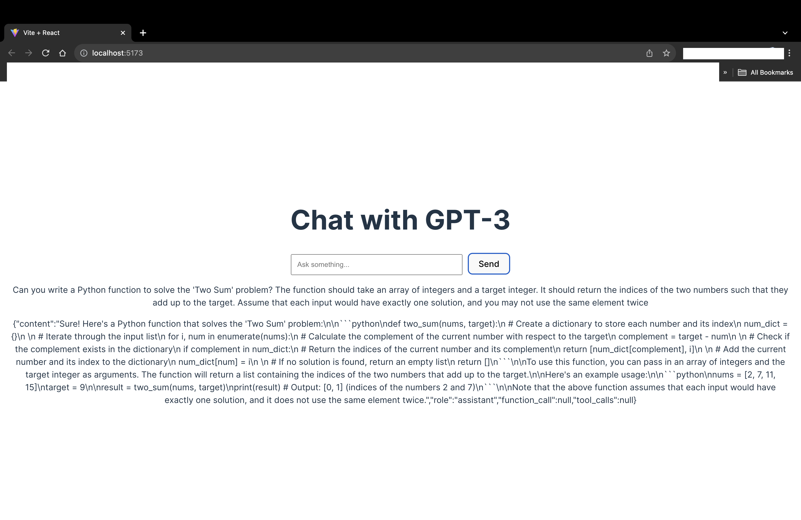
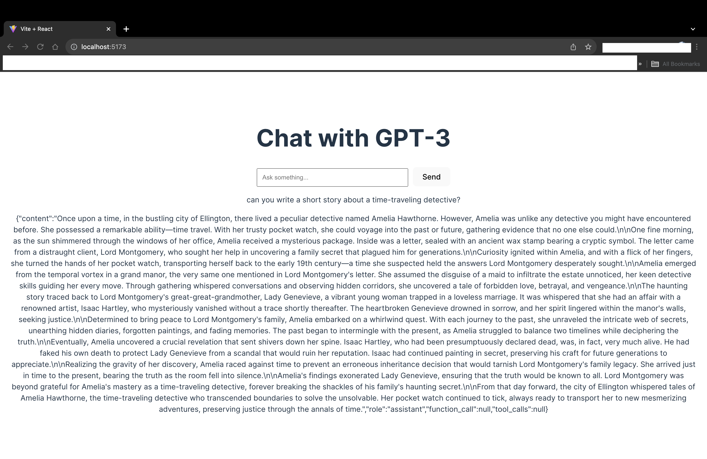
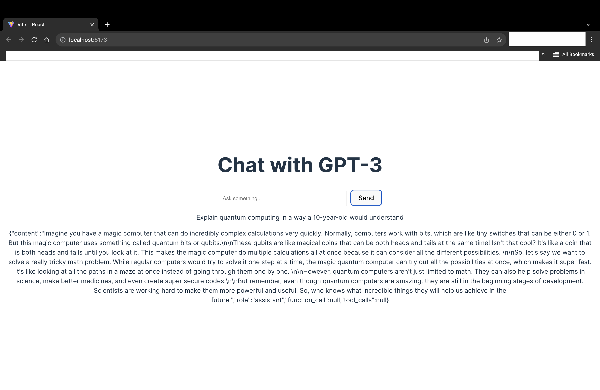
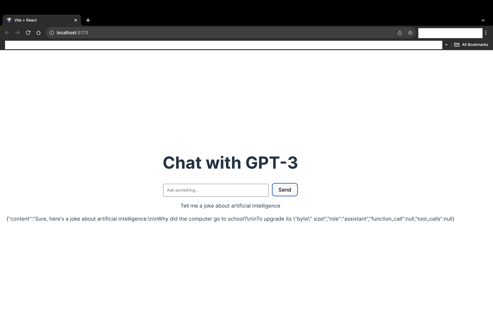
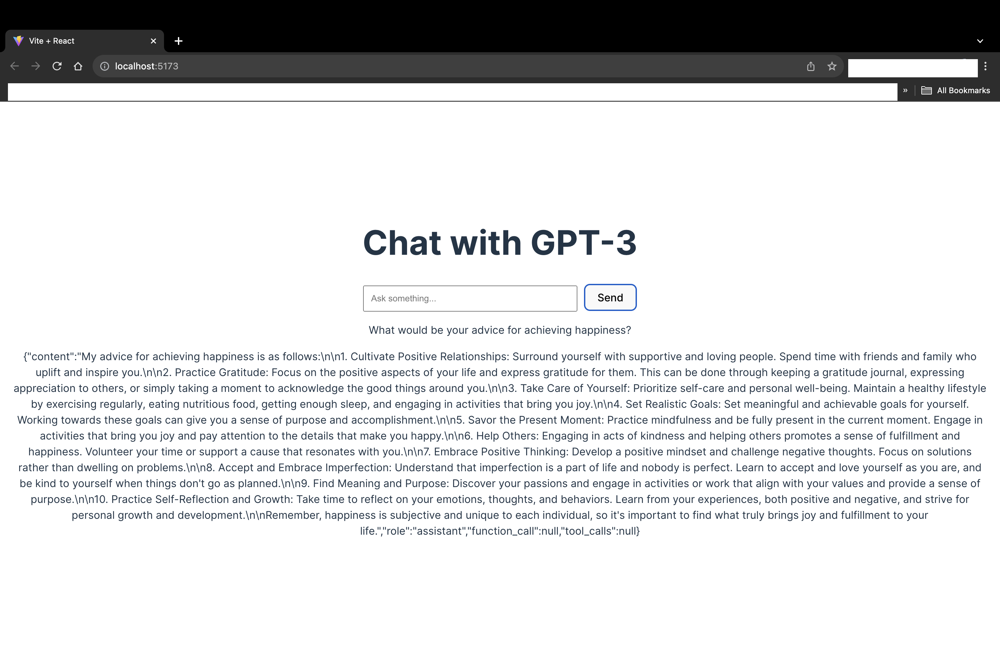
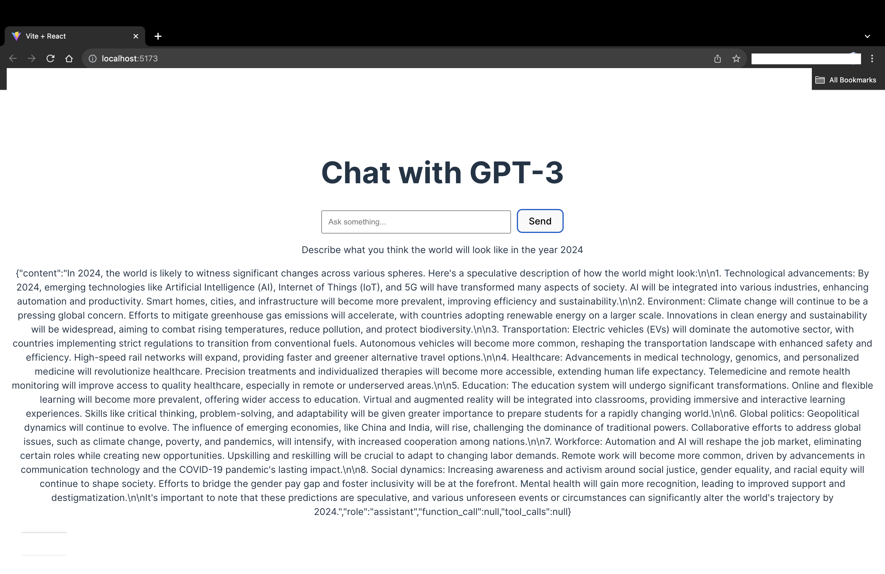

# Python-GPT: A ChatGPT API Integration with React Frontend

[![Contributors][contributors-shield]][contributors-url]
[![Forks][forks-shield]][forks-url]
[![Stargazers][stars-shield]][stars-url]
[![Issues][issues-shield]][issues-url]
[![MIT License][license-shield]][license-url]

## About The Project


Python-GPT is an innovative project that integrates OpenAI's ChatGPT with a Python backend (FastAPI) and a React frontend. This application allows users to interact with ChatGPT in a user-friendly web interface, providing a seamless experience for querying and receiving responses from the AI model.

### Built With

- [![React][React.js]][React-url]
- [![FastAPI][FastAPI]][FastAPI-url]
- [![Vite][Vite]][Vite-url]
- [![OpenAI API][OpenAI]][OpenAI-url]


### Getting Started

To get a local copy up and running, follow these simple steps.


Prerequisites

- Node.js and npm
```sh
  npm install npm@latest -g
```
- Python 3.7+

### Installation

1. Clone the repo
2. Install NPM packages for the React frontend
3. Set up the Python virtual environment and install dependencies for the backend
4. Enter your OpenAI API key in the .env file in the backend directory

### Usage

Python-GPT can be used to interact with the ChatGPT model for various purposes, such as getting answers to questions, generating text based on prompts, or even having a casual conversation with the AI.

To start the backend server:

```

uvicorn main:app --reload
```

To run the frontend:

```

cd frontend npm run dev
```

## Demo

### Two Sum Problem Solution

In this demo, we posed a popular junior developer interview question to our ChatGPT-3 app: "Write a Python function to solve the 'Two Sum' problem."

The 'Two Sum' problem is a classic coding interview question that tests understanding of arrays and hash tables. The challenge is to find two numbers in an array that add up to a specific target number.

Here's the AI-generated solution to this problem:



*The screenshot above shows the ChatGPT-3 app's response to the Two Sum problem, demonstrating its capability to assist with coding interview preparations.*

---

### Creative Writing Prompt

**Question:** "Can you write a short story about a time-traveling detective?"

This prompt showcases ChatGPT-3's ability to create imaginative and narrative content.



*The screenshot above displays the AI's creative storytelling skills.*

---

### Technical Explanation in Simple Terms

**Question:** "Explain quantum computing in a way a 10-year-old would understand."

This demonstrates the AI's capability to simplify complex concepts for a younger audience.



*Here, ChatGPT-3 breaks down the complexities of quantum computing into simpler terms.*

---

### Humorous Response

**Question:** "Tell me a joke about artificial intelligence."

This prompt highlights the AI's lighter, more humorous side.



*The AI's response to a humorous prompt, showcasing its wit.*

---

### Philosophical Inquiry

**Question:** "What would be your advice for achieving happiness?"

This type of question can lead to interesting, thought-provoking responses from the AI.



*ChatGPT-3's philosophical take on achieving happiness.*

---

### Futuristic Scenario

**Question:** "Describe what you think the world will look like in the year 2024."

This prompt showcases the AI's ability to generate speculative and futuristic ideas.



*The AI's vision of the future, as depicted in its response.*


## Roadmap

- Implement user authentication for personalized experiences.
- Add more interactive features to the frontend.
- Integrate additional AI models for diverse functionalities.

See the open issues for a full list of proposed features (and known issues).


## Contributing

Contributions are what make the open source community such an amazing place to learn, inspire, and create. Any contributions you make are greatly appreciated.

1. Fork the Project
2. Create your Feature Branch (git checkout -b feature/AmazingFeature)
3. Commit your Changes (git commit -m 'Add some AmazingFeature')
4. Push to the Branch (git push origin feature/AmazingFeature)
5. Open a Pull Request

### License

Distributed under the MIT License. See LICENSE.txt for more information.


### Contact

Dalonte Griffin
 
  [![LinkedIn][linkedin-icon]][linkedin-url]


Project Link: https://github.com/dalgriff/python-gpt


Acknowledgments

- OpenAI
- FastAPI
- React
- Vite


<!-- MARKDOWN LINKS & IMAGES -->
[linkedin-icon]: https://img.icons8.com/fluent/48/000000/linkedin.png
[linkedin-url]: https://www.linkedin.com/in/dalonte-griffin-9baa66a/
[contributors-shield]: https://img.shields.io/github/contributors/dalgriff/python-chatgpt.svg?style=for-the-badge
[contributors-url]: https://github.com/dalgriff/python-chatgpt/graphs/contributors
[forks-shield]: https://img.shields.io/github/forks/dalgriff/python-chatgpt.svg?style=for-the-badge
[forks-url]: https://github.com/dalgriff/python-chatgpt/network/members
[stars-shield]: https://img.shields.io/github/stars/dalgriff/python-chatgpt.svg?style=for-the-badge
[stars-url]: https://github.com/dalgriff/python-chatgpt/stargazers
[issues-shield]: https://img.shields.io/github/issues/dalgriff/python-chatgpt.svg?style=for-the-badge
[issues-url]: https://github.com/dalgriff/python-chatgpt/issues
[license-shield]: https://img.shields.io/github/license/dalgriff/python-chatgpt.svg?style=for-the-badge
[license-url]: https://github.com/dalgriff/python-chatgpt/blob/master/LICENSE.txt

[React.js]: https://img.shields.io/badge/React-20232A?style=for-the-badge&logo=react&logoColor=61DAFB
[React-url]: https://reactjs.org/
[FastAPI]: https://img.shields.io/badge/FastAPI-009688?style=for-the-badge&logo=fastapi
[FastAPI-url]: https://fastapi.tiangolo.com/
[Vite]: https://img.shields.io/badge/Vite-B73BFE?style=for-the-badge&logo=vite&logoColor=FFD62E
[Vite-url]: https://vitejs.dev/
[OpenAI]: https://img.shields.io/badge/OpenAI-000000?style=for-the-badge&logo=openai
[OpenAI-url]: https://openai.com/api/

